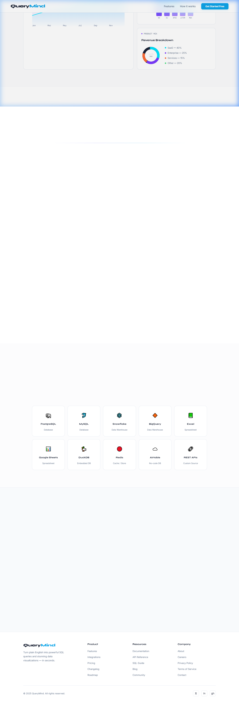
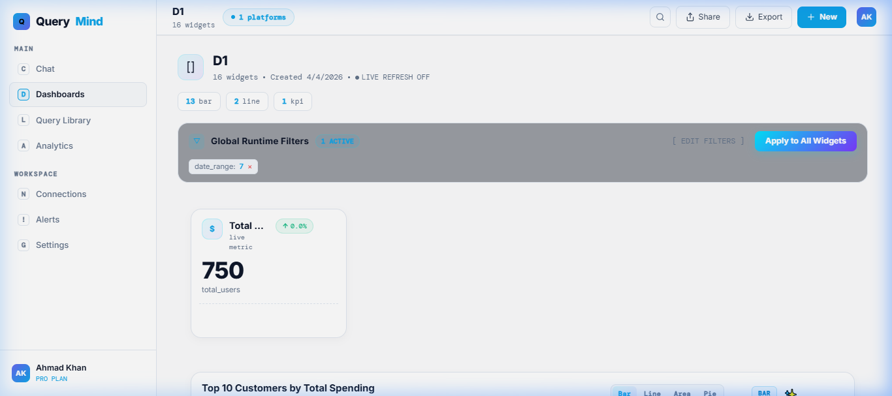
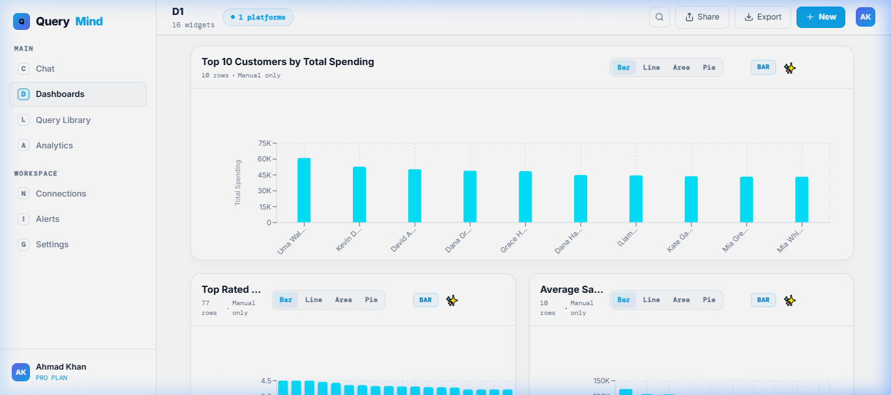
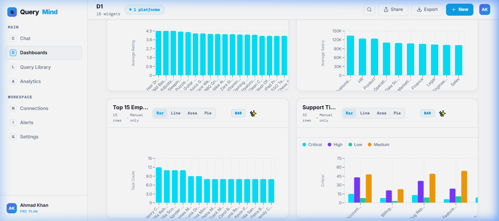
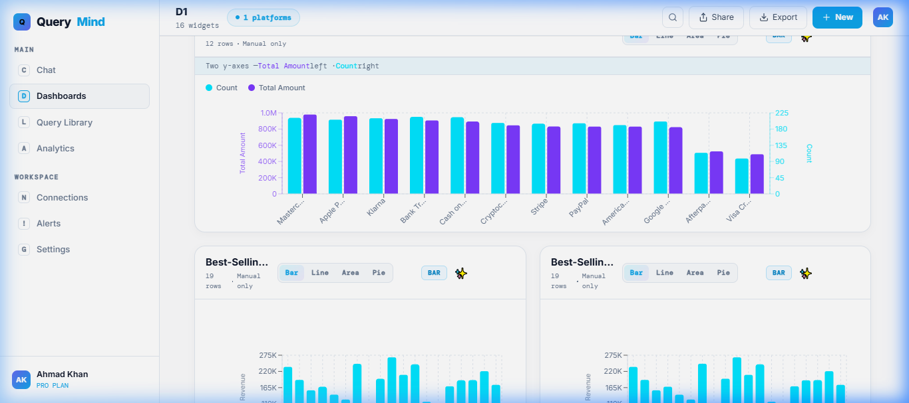
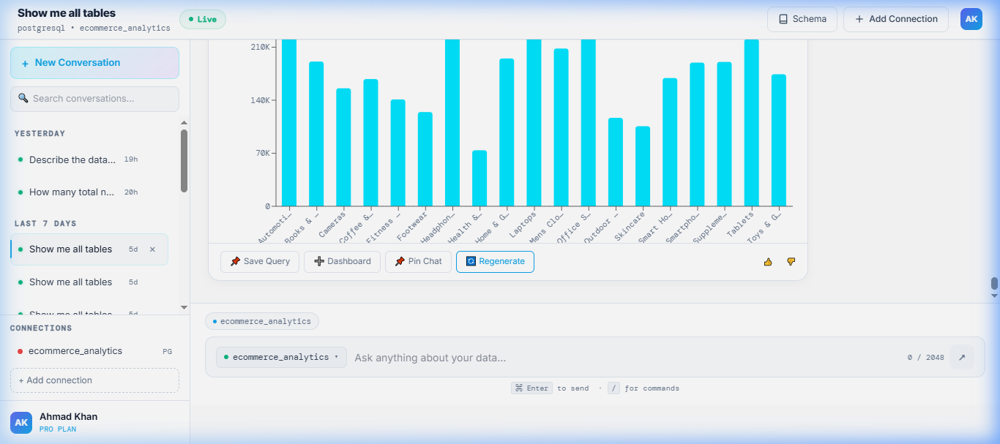
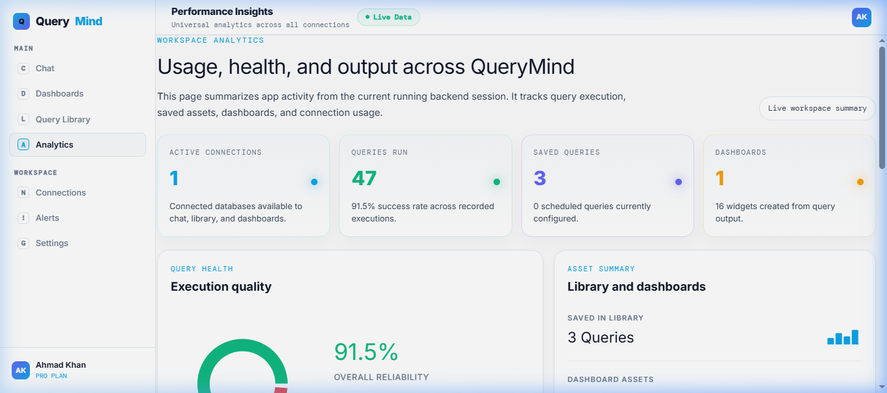
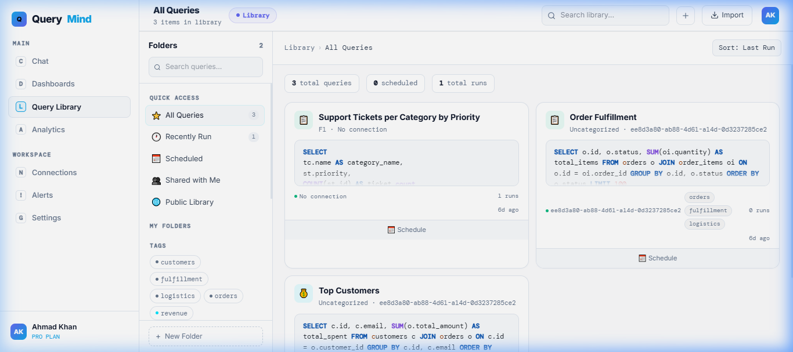
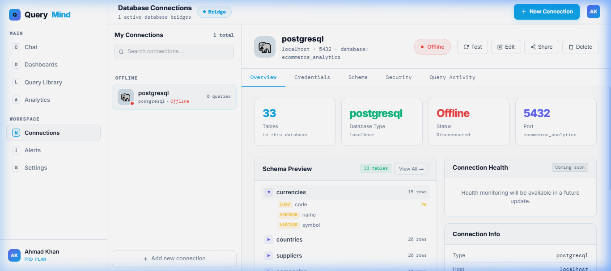

# InsightAI 🧠📊

### **Talk to your Data. Get Insights in Seconds.**
A next-generation **Natural Language Business Intelligence (BI)** platform. Connect your database, ask questions in plain English, and watch as specialized AI agents generate SQL, execute it, and build interactive dashboards for you.

---

## 🏗️ Visual Showcase

*Modern, glassmorphism-inspired landing page with 20-column precision grid.*

| Dashboard (Top) | Dashboard (Upper-Mid) |
| :---: | :---: |
|  |  |

| Dashboard (Lower-Mid) | Dashboard (Bottom) |
| :---: | :---: |
|  |  |

| AI Chat Deep-Dive | Advanced Analytics |
| :---: | :---: |
|  |  |

| Query Library | Connection Hub |
| :---: | :---: |
|  |  |

---

## ✨ Core Features

### 🤖 **The LangGraph Brain**
InsightAI isn't just a simple wrapper. It uses a **Multi-Agent Orchestration** engine powered by **LangGraph** to handle the complexity of data analysis:
- **Autonomous SQL Generation**: Specialized agents write optimized SQL based on your schema.
- **Self-Correction Loop**: If a query fails, the agent analyzes the error and automatically corrects the SQL.
- **Smart Chart Recommendations**: AI analyzes your data shape to suggest the perfect visualization (Bar, Line, Radar, etc.).

### 📊 **SaaS 2.0 BI Dashboard**
- **20-Column Grid Layout**: A precision-engineered dashboard system for infinite customization.
- **Interactive Widgets**: Pin any AI-generated query to your personal or shared dashboards.
- **Enterprise Analytics**: Real-time stats on query performance, usage, and database health.

### 🔐 **Core Infrastructure**
- **Supabase Integration**: Built-in authentication and persistent database storage for sessions, connections, and dashboards.
- **Multi-Database Support**: Connect to PostgreSQL (and others) with enterprise-grade safety (read-only enforcement).
- **FastAPI Backend**: High-performance, asynchronous backend designed for scale.

---

## 🛠️ Tech Stack

| Layer | Technologies |
| :--- | :--- |
| **Frontend** | React 18, Vite, TypeScript, Tailwind CSS, Recharts, Lucide Icons |
| **Backend** | FastAPI, LangGraph, LangChain, CrewAI, Pydantic v2 |
| **Database/Auth** | Supabase (PostgreSQL), PostgreSQL (Analytics Data) |
| **AI Models** | Groq (Llama 3/DeepSeek), OpenAI (GPT-4o compatible) |

---

## 🚀 Quick Start

### 1. Backend Setup
```bash
cd backend
python -m venv venv
source venv/bin/activate  # Windows: venv\Scripts\activate
pip install -r requirements.txt
cp .env.example .env
# Configure your GROQ_API_KEY and SUPABASE settings
python main.py
```

### 2. Frontend Setup
```bash
cd frontend
npm install
npm run dev
```

### 3. Environment Variables
Ensure your `backend/.env` contains:
```env
GROQ_API_KEY=your_key_here
DATABASE_URL=your_postgres_url
SUPABASE_URL=your_supabase_url
SUPABASE_KEY=your_supabase_anon_key
```

---

## 🎥 Product Walkthrough

*Check out the full capabilities of InsightAI in action—from natural language queries to automated BI dashboards.*

---

## 📂 Project Structure
- `backend/ai_core`: The LangGraph orchestration logic.
- `backend/database`: Connection management and schema inspection.
- `frontend/src/pages`: SaaS 2.0 app screens (Chat, Analytics, Dashboards).
- `frontend/src/components/charts`: Modular, AI-ready visualization components.

---

## 📄 License
MIT License - Developed for InsightAI.
